# SecondSelf — Phase-Wise Implementation Plan

> **References:** `Problem_statement.md`, `architecture.md`  
> **Goal:** Build capture → classify → link → graph → ask → deploy end-to-end.

---

## Overview

| Phase | Name | Duration (est.) | Deliverable |
|-------|------|-----------------|-------------|
| 0 | Project Setup | 2–4 hours | Repo scaffold, deps, config |
| 1 | Capture Pipeline | 1–2 days | `capture.py` + 10+ real captures |
| 2 | Auto-Classification | 1–2 days | `classify.py` + PARA wiki notes |
| 3 | Auto-Linking | 1–2 days | `link.py` + semantic links |
| 4 | Graph Builder | 1 day | `build_graph.py` + `graph.json` |
| 5 | Graph UI + RAG + App | 2–3 days | vis-network + `ask.py` + `app.py` |
| 6 | Local Integration Test | 1 day | Full pipeline on real data |
| 7 | Local Q&A Validation | 0.5 day | 5+ real questions answered |
| 8 | Deploy to Cloud | 0.5–1 day | Public URL live |
| 9 | Final E2E Verification | 0.5 day | Deployed app smoke test + README |

**Total estimated time:** 4 weeks (aligned with weekly milestones)

---

## Phase 0 — Project Setup

**Objective:** Scaffold the repo so every later phase has a stable foundation.

### Tasks

- [ ] Create repo directory structure:
  ```
  secondself/
  ├── raw/
  ├── wiki/
  │   ├── Projects/
  │   ├── Areas/
  │   ├── Resources/
  │   └── Archives/
  ├── data/
  └── logs/
  ```
- [ ] Create `requirements.txt` with all dependencies
- [ ] Create `config.py` with paths, model names, thresholds
- [ ] Create `models.py` with shared dataclasses:
  - `CaptureMetadata`
  - `WikiNote`
  - `GraphNode`, `GraphEdge`
  - `AskResponse`
- [ ] Create `.env.example` with `GROQ_API_KEY=your_key_here`
- [ ] Create `.gitignore` (`.env`, `__pycache__/`, `data/embeddings.pkl`, optional `raw/` if private)
- [ ] Install dependencies: `pip install -r requirements.txt`
- [ ] Sign up for Groq API key at https://console.groq.com
- [ ] Verify Python 3.10+ and create virtual environment

### Acceptance Criteria

- [ ] All folders exist
- [ ] `pip install -r requirements.txt` succeeds
- [ ] `config.py` imports without error
- [ ] `.env` loaded locally with valid `GROQ_API_KEY`

### Commands

```bash
python -m venv .venv
.venv\Scripts\activate        # Windows
pip install -r requirements.txt
copy .env.example .env        # then edit .env
python -c "import config; print('OK')"
```

---

## Phase 1 — Capture Pipeline (Week 1: The Archivist)

**Objective:** One command captures any note, link, or file into `raw/` with timestamp + unique ID.

### Tasks

- [ ] Implement `capture.py`:
  - [ ] `--note "text"` → saves `.txt` + `.meta.json`
  - [ ] `--url "https://..."` → saves `.url` + `.meta.json`
  - [ ] `--file "path/to/file"` → copies file + `.meta.json`
- [ ] Generate UUID4 for each capture
- [ ] Timestamp format: `YYYYMMDD_HHMMSS_{short_id}`
- [ ] Write sidecar metadata JSON for every capture
- [ ] Compute content hash (SHA-256) for dedup detection
- [ ] Add basic CLI help and error messages
- [ ] Capture 10+ real items from your own scattered information

### File Outputs

```
raw/
  20250722_143022_a1b2c3d4.txt
  20250722_143022_a1b2c3d4.meta.json
  20250722_143045_e5f6g7h8.url
  20250722_143045_e5f6g7h8.meta.json
  20250722_143100_i9j0k1l2.pdf
  20250722_143100_i9j0k1l2.meta.json
```

### Acceptance Criteria

- [ ] `raw/` and `wiki/` folder structure exists
- [ ] One command captures a note, a link, AND a file
- [ ] Every capture has timestamp + unique ID
- [ ] 10+ real items captured (not test data)

### Test Commands

```bash
python capture.py --note "Meeting notes: discuss RAG architecture"
python capture.py --url "https://python.org"
python capture.py --file "C:\Users\you\Documents\paper.pdf"
dir raw\
```

---

## Phase 2 — Auto-Classification (Week 2.1: The Sorting Hat)

**Objective:** Send raw captures to Groq/Llama 3; get PARA category, tags, summary; write to `wiki/`.

### Tasks

- [ ] Implement `classify.py`:
  - [ ] `load_unprocessed_raw()` — scan `raw/` for `processed: false`
  - [ ] `extract_text()` — handle `.txt`, `.url`, `.pdf` (pypdf)
  - [ ] `call_llm_classify()` — Groq API with structured JSON prompt
  - [ ] `write_wiki_note()` — markdown + YAML frontmatter
  - [ ] `mark_raw_processed()` — update sidecar metadata
- [ ] Design LLM prompt for PARA + tags + summary + title
- [ ] Validate LLM output against allowed PARA categories
- [ ] Slugify titles for filenames
- [ ] Run on all Week 1 captures

### LLM Prompt Template

```
You are a personal knowledge organizer using the PARA method.
Given the following capture, return JSON with:
- para_category: one of Projects, Areas, Resources, Archives
- title: concise title
- tags: array of 2-5 tags
- summary: one-line summary

Capture:
{content}
```

### Acceptance Criteria

- [ ] Any raw capture → category + tags + summary automatically
- [ ] PARA categorization working (notes land in correct subfolder)
- [ ] Wiki notes have valid YAML frontmatter
- [ ] Raw metadata updated to `processed: true`

### Test Commands

```bash
python classify.py --all
python classify.py --id a1b2c3d4
dir wiki\Resources\
```

---

## Phase 3 — Auto-Linking (Week 2.2: Connect the Dots)

**Objective:** Compute embeddings, find similar notes, auto-insert links — no manual tagging.

### Tasks

- [ ] Implement `link.py`:
  - [ ] Load `sentence-transformers` model (`all-MiniLM-L6-v2`)
  - [ ] Embed each wiki note (`title + summary + body excerpt`)
  - [ ] Persist vectors to `data/embeddings.pkl`
  - [ ] Compare new notes against all existing notes (cosine similarity)
  - [ ] Auto-insert `[[note-id]]` links in `## Related` section
  - [ ] Update frontmatter `links` array
- [ ] Tune `SIMILARITY_THRESHOLD` (start 0.75, adjust on real data)
- [ ] Cap links per note at `MAX_LINKS_PER_NOTE = 5`
- [ ] Run on 15+ real items total

### Acceptance Criteria

- [ ] Embeddings computed per note
- [ ] Related notes auto-linked (no manual tagging)
- [ ] Runs on 15+ real items → organized, linked `wiki/`
- [ ] Embedding index persists across runs

### Test Commands

```bash
python link.py --all
python link.py --note-id a1b2c3d4
python -c "import pickle; print(len(pickle.load(open('data/embeddings.pkl','rb'))))"
```

---

## Phase 4 — Graph Builder (Week 3.1: Give It a Shape)

**Objective:** Read wiki notes + links → build nodes/edges → export clean JSON.

### Tasks

- [x] Implement `build_graph.py`:
  - [x] Scan all `wiki/**/*.md` files
  - [x] Parse YAML frontmatter + `[[links]]`
  - [x] Build node list (id, label, category, tags, summary, wiki_path)
  - [x] Build edge list (source, target, type, weight)
  - [x] Dedupe edges
  - [x] Export to `data/graph.json`
- [x] Add metadata block (generated_at, node_count, edge_count)
- [x] Node size proportional to link count (optional)

### Graph JSON Shape

See `architecture.md` §4.3 for full schema.

### Acceptance Criteria

- [x] Script builds nodes + edges from notes
- [x] Exports clean, valid JSON
- [x] JSON loads without error in any JSON validator
- [x] Built from real notes, not dummy data

### Test Commands

```bash
python build_graph.py
python -c "import json; g=json.load(open('data/graph.json')); print(g['metadata'])"
```

---

## Phase 5 — Graph UI, RAG, and Streamlit App (Weeks 3.2 + 4)

**Objective:** Interactive graph + ask-anything search in one Streamlit app.

### 5A — Interactive Graph (Week 3.2)

- [x] Create vis-network HTML template with:
  - [x] Force-directed layout
  - [x] Node colors by PARA category
  - [x] Hover tooltips (summary + tags)
  - [x] Drag + zoom
  - [x] Click node → callback to Streamlit
- [x] Embed via `streamlit.components.v1.html()`
- [x] Load `data/graph.json` at render time

### 5B — RAG Q&A (Week 4.1)

- [x] Implement `ask.py`:
  - [x] `ask(question: str) -> AskResponse`
  - [x] Embed question with same model as notes
  - [x] Retrieve top-k notes by cosine similarity
  - [x] Build context prompt with note excerpts
  - [x] Call Groq LLM to synthesize answer
  - [x] Return answer + source citations
- [x] System prompt: answer ONLY from provided notes; cite sources; say "I don't know" if not found

### 5C — Streamlit App (Week 4.2)

- [x] Implement `app.py`:
  - [x] Page title + layout (graph left, ask right)
  - [x] Graph panel (vis-network component)
  - [x] Ask panel (text input + submit + answer display)
  - [x] Source citations below answer
  - [x] Sidebar: note count, PARA breakdown, link count
  - [x] Optional: "Rebuild Graph" button

### Optional: `pipeline.py`

- [x] `python pipeline.py ingest` — classify + link + graph
- [x] `python pipeline.py ask "question"`

### Acceptance Criteria

- [x] Interactive force-directed graph renders from JSON
- [x] Hover reveals note content
- [x] Drag + zoom work
- [x] `ask()` returns answers synthesized from your own notes
- [x] One Streamlit app contains both graph and search bar

### Test Commands

```bash
streamlit run app.py
python -c "from ask import ask; print(ask('What notes do I have about machine learning?'))"
```

---

## Phase 6 — Local Integration Test

**Objective:** Verify the full pipeline works end-to-end on your machine.

### Test Script

```bash
# 1. Capture
python capture.py --note "Test integration note about vector databases"
python capture.py --url "https://www.sentence-transformers.com"

# 2. Process
python classify.py --all
python link.py --all
python build_graph.py

# 3. Launch app
streamlit run app.py
```

### Checklist

- [ ] New capture appears in `raw/`
- [ ] Classify creates wiki note in correct PARA folder
- [ ] Link adds Related section if similar notes exist
- [ ] Graph JSON updates with new node
- [ ] Graph renders new node in Streamlit
- [ ] Ask returns relevant answer with sources
- [ ] No unhandled exceptions in `logs/secondself.log`

---

## Phase 7 — Local Q&A Validation

**Objective:** Confirm RAG quality on real questions about your own notes.

### Test Questions (write 5+ based on YOUR captures)

Example template — replace with questions you can actually answer from your notes:

1. "What projects am I currently working on?"
2. "What resources do I have about [topic you captured]?"
3. "Summarize everything I saved about [specific theme]"
4. "What notes are related to [concept]?"
5. "What did I bookmark about [subject]?"

### Validation Criteria

- [ ] Answer is grounded in retrieved notes (not hallucinated)
- [ ] Sources listed match the answer content
- [ ] "I don't know" returned when no relevant notes exist
- [ ] Response time under 10 seconds on local machine

---

## Phase 8 — Deploy to Cloud

**Objective:** Public URL anyone can open.

### Pre-Deploy Checklist

- [ ] Remove or redact sensitive notes from `wiki/` and `raw/`
- [ ] Commit `wiki/`, `data/graph.json`, `data/embeddings.pkl`
- [ ] README.md with setup instructions
- [ ] `requirements.txt` pinned to working versions
- [ ] `.streamlit/config.toml` (optional theme config)

### Streamlit Cloud Steps

1. Push repo to public GitHub
2. Go to https://share.streamlit.io
3. Connect repo → select `app.py`
4. Add secret: `GROQ_API_KEY`
5. Deploy → copy public URL

### HF Spaces Alternative

1. Create new Space (Streamlit SDK)
2. Push code
3. Add `GROQ_API_KEY` in Space secrets
4. Verify app loads

### Acceptance Criteria

- [ ] Deployed live with a public URL
- [ ] Graph renders on deployed app
- [ ] Ask search works on deployed app
- [ ] No API key exposed in repo or UI

---

## Phase 9 — Final E2E Verification & Documentation

**Objective:** Ship SecondSelf — complete product with README and verified flow.

### Final Checklist

- [ ] Public GitHub repo with clean README
- [ ] Live deployed URL in README
- [ ] End-to-end flow verified: capture → classify → link → graph → ask
- [ ] All 4 weekly milestones complete:
  - [ ] 🏅 The Archivist (Capture Pipeline)
  - [ ] 🏅 The Librarian (Self-Organizing Wiki)
  - [ ] 🏅 The Cartographer (Living Brain)
  - [ ] 🏅 The Oracle (SecondSelf deployment)

### README Must Include

- Project description (1 paragraph)
- Architecture diagram or link to `architecture.md`
- Setup instructions (venv, pip install, .env)
- Usage examples (capture, classify, ask)
- Live demo URL
- Tech stack list

### Smoke Test on Deployed URL

1. Open public URL
2. Graph loads with nodes and edges
3. Hover a node → summary appears
4. Ask a question → answer + sources appear
5. No 500 errors in browser console

---

## Build Order Summary (Cursor Workflow)

```
Phase 0  →  Scaffold repo + config
Phase 1  →  capture.py
Phase 2  →  classify.py
Phase 3  →  link.py
Phase 4  →  build_graph.py
Phase 5  →  Graph UI + ask.py + app.py
Phase 6  →  Local integration test
Phase 7  →  Q&A validation
Phase 8  →  Deploy
Phase 9  →  Final verification + README
```

---

## Dependencies Between Phases

```mermaid
flowchart LR
    P0[Phase 0 Setup] --> P1[Phase 1 Capture]
    P1 --> P2[Phase 2 Classify]
    P2 --> P3[Phase 3 Link]
    P3 --> P4[Phase 4 Graph]
    P4 --> P5[Phase 5 UI + RAG]
    P5 --> P6[Phase 6 Integration]
    P6 --> P7[Phase 7 Q&A Test]
    P7 --> P8[Phase 8 Deploy]
    P8 --> P9[Phase 9 Final]
```



Each phase builds on the previous. Do not skip ahead — Week N output becomes Week N+1 input.
