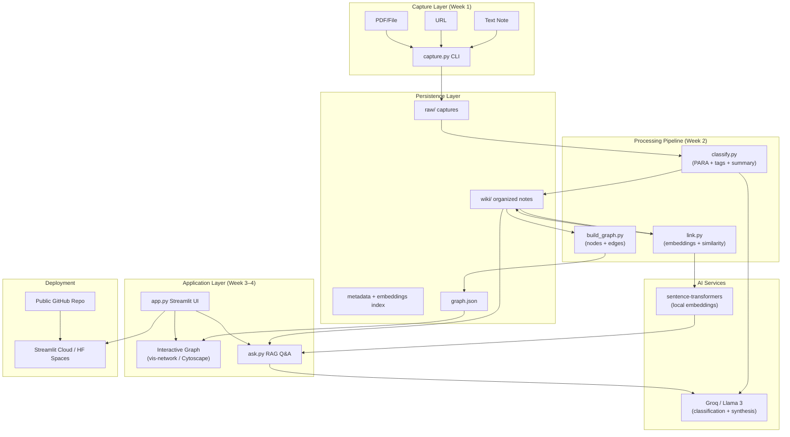
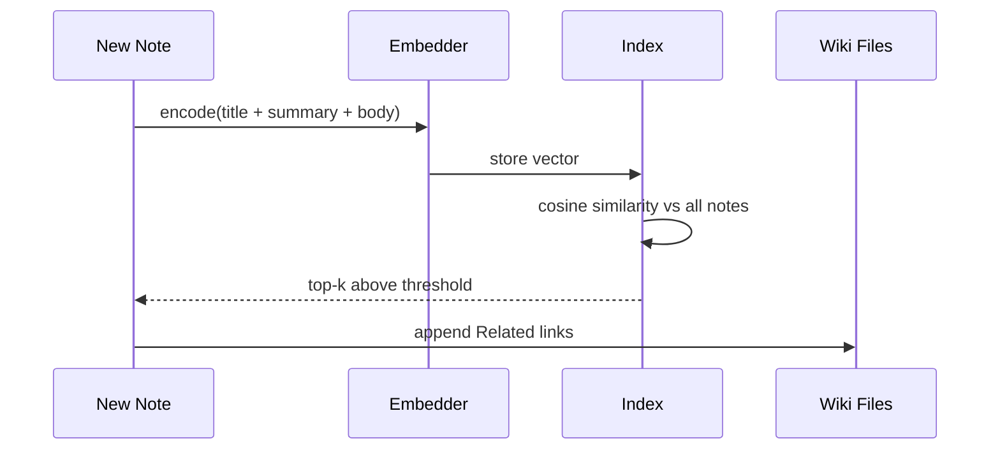
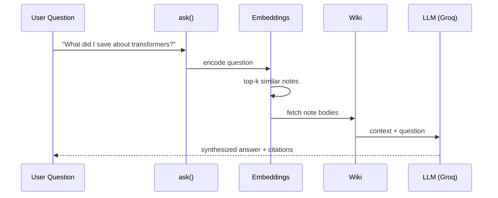
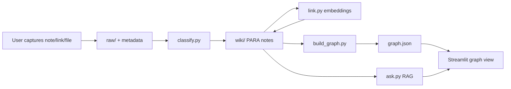
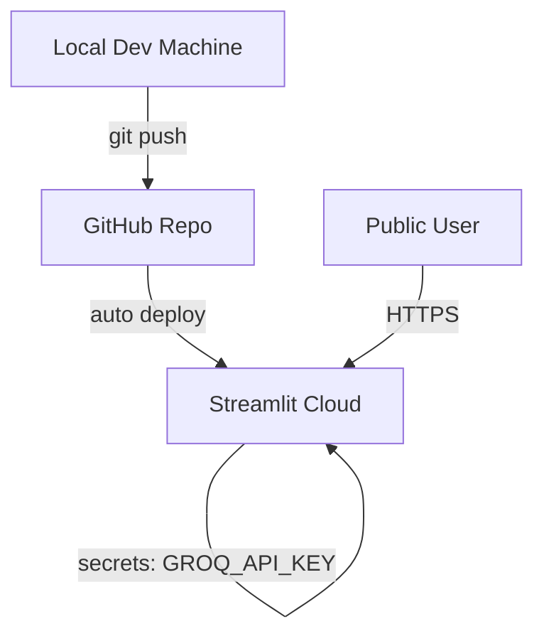

# SecondSelf — System Architecture

> **Project:** SecondSelf — Your Personal AI Second Brain  
> **Purpose:** This document describes HOW we will build the project.

---

## 1. Vision & Design Principles

SecondSelf is not a notes app or a generic chatbot. It is a **self-organizing knowledge graph with retrieval-augmented Q&A** over your own captured information.

| Principle | Implication |
|-----------|-------------|
| **Capture-first** | Zero friction at input; structure comes later |
| **AI does filing** | No manual tagging; PARA + embeddings drive organization |
| **Knowledge compounds** | Auto-linking creates emergent structure |
| **Visual + conversational** | Graph for exploration, NL search for answers |
| **Local-first, cloud-deployable** | Files on disk; free-tier LLM/embeddings; Streamlit for UI |
| **Pipeline composability** | Each week's output is the next week's input |

---

## 2. High-Level Architecture



---

## 3. Repository & Module Structure

```
secondself/
├── raw/                          # Immutable capture inbox
│   └── {timestamp}_{uuid}.{ext}
├── wiki/                         # Processed, linked markdown notes
│   └── {category}/{slug}.md
├── data/                         # Derived indexes
│   ├── embeddings.pkl
│   └── graph.json
├── logs/                         # Pipeline logs
├── capture.py                    # Week 1: CLI capture
├── classify.py                   # Week 2.1: PARA classification
├── link.py                       # Week 2.2: embedding + auto-link
├── build_graph.py                # Week 3.1: graph JSON export
├── ask.py                        # Week 4.1: RAG Q&A
├── app.py                        # Week 4.2: Streamlit shell
├── pipeline.py                   # Optional: orchestrates classify→link→graph
├── config.py                     # Paths, thresholds, API keys
├── models.py                     # Shared dataclasses/schemas
├── requirements.txt
├── .env.example
└── README.md
```

---

## 4. Data Architecture

### 4.1 Raw Capture Schema

Each item in `raw/` is an immutable capture event.

```
raw/
  20250722_143022_a1b2c3d4.txt
  20250722_143045_e5f6g7h8.url
  20250722_143100_i9j0k1l2.pdf
  20250722_143100_i9j0k1l2.meta.json
```

**Sidecar metadata (`*.meta.json`):**

```json
{
  "id": "a1b2c3d4-e5f6-7890-abcd-ef1234567890",
  "captured_at": "2025-07-22T14:30:22+05:30",
  "type": "note | link | file",
  "source": "cli",
  "original_filename": "research.pdf",
  "content_hash": "sha256:...",
  "processed": false,
  "wiki_path": null
}
```

### 4.2 Wiki Note Schema

Processed notes live in `wiki/` as Markdown with YAML frontmatter.

```markdown
---
id: a1b2c3d4-e5f6-7890-abcd-ef1234567890
title: "Transformer attention mechanisms"
para_category: Resources
tags: [ml, nlp, transformers]
summary: "Overview of self-attention in transformer models."
created_at: 2025-07-22T14:30:22+05:30
updated_at: 2025-07-22T16:00:00+05:30
links: [note-id-2, note-id-3]
embedding_id: emb_001
source_raw: raw/20250722_143022_a1b2c3d4.txt
---

# Transformer attention mechanisms

Original content or extracted text...

## Related
- [[note-id-2]]
- [[note-id-3]]
```

**PARA folder layout:**

```
wiki/
├── Projects/
├── Areas/
├── Resources/
└── Archives/
```

| PARA | When AI assigns it |
|------|-------------------|
| **Projects** | Time-bound goals with outcome |
| **Areas** | Ongoing responsibilities |
| **Resources** | Reference material, topics of interest |
| **Archives** | Inactive / completed / stale |

### 4.3 Graph Schema (`data/graph.json`)

```json
{
  "nodes": [
    {
      "id": "a1b2c3d4",
      "label": "Transformer attention",
      "category": "Resources",
      "tags": ["ml", "nlp"],
      "summary": "Overview of self-attention...",
      "wiki_path": "wiki/Resources/transformer-attention.md"
    }
  ],
  "edges": [
    {
      "source": "a1b2c3d4",
      "target": "b2c3d4e5",
      "type": "semantic_similarity",
      "weight": 0.87
    }
  ],
  "metadata": {
    "generated_at": "2025-07-22T18:00:00Z",
    "node_count": 42,
    "edge_count": 67
  }
}
```

### 4.4 Embeddings Index

Store `{note_id: vector}` in `data/embeddings.pkl` (or SQLite for larger sets). For 15–500 notes, pickle is sufficient.

---

## 5. Component Architecture

### 5.1 `capture.py` — The Archivist (Week 1)

**Responsibility:** Single entry point for all inputs.

```
capture.py
├── parse_args()           # --note, --url, --file
├── generate_id()          # UUID4
├── timestamp_filename()   # YYYYMMDD_HHMMSS_{short_id}
├── save_note(text)
├── save_link(url)
├── save_file(path)        # copy into raw/, preserve extension
└── write_metadata(sidecar)
```

**CLI interface:**

```bash
python capture.py --note "idea about RAG pipelines"
python capture.py --url "https://example.com/article"
python capture.py --file "./paper.pdf"
```

**Design decisions:**
- Raw files are never edited after capture (audit trail).
- File captures copy into `raw/`, not symlink (portable for deploy).
- PDF text extraction happens at classify time, not capture time.

---

### 5.2 `classify.py` — The Sorting Hat (Week 2.1)

**Responsibility:** Transform raw captures into structured wiki notes.

```
classify.py
├── load_unprocessed_raw()
├── extract_text(capture)       # .txt, .url body, PDF via pypdf
├── call_llm_classify(text)     # Groq API → PARA + tags + summary
├── slugify(title)
├── write_wiki_note(frontmatter + body)
└── mark_raw_processed(meta)
```

**LLM prompt contract (structured output):**

```json
{
  "para_category": "Projects | Areas | Resources | Archives",
  "title": "string",
  "tags": ["tag1", "tag2"],
  "summary": "one-line summary",
  "confidence": 0.92
}
```

**Batch mode:** `python classify.py --all`

---

### 5.3 `link.py` — Connect the Dots (Week 2.2)

**Responsibility:** Semantic linking without manual tags.

```
link.py
├── load_all_wiki_notes()
├── embed_note(text)                    # sentence-transformers
├── load_or_create_embedding_index()
├── find_similar(note_id, threshold=0.75)
├── insert_wiki_links(source, targets)
├── persist_embedding_index()
└── optional: create back-links
```

**Similarity pipeline:**



**Key parameters (`config.py`):**

```python
SIMILARITY_THRESHOLD = 0.75
MAX_LINKS_PER_NOTE = 5
EMBEDDING_MODEL = "all-MiniLM-L6-v2"
```

**Embedding input:** `title + summary + first 500 chars of body`

---

### 5.4 `build_graph.py` — The Cartographer (Week 3.1)

**Responsibility:** Materialize the knowledge graph for visualization.

```
build_graph.py
├── scan_wiki_notes()
├── parse_frontmatter_links()
├── build_nodes(notes)
├── build_edges(from frontmatter + semantic edges)
├── dedupe_edges()
└── export_graph_json("data/graph.json")
```

**Node attributes for UI:** `id`, `label`, `category`, `tags`, `summary`, `size` (by link count)

**Edge types:**
- `explicit_link` — from `[[note-id]]` in markdown
- `semantic_similarity` — from embedding pipeline

---

### 5.5 Graph UI — Interactive Brain (Week 3.2)

Embed **vis-network** via Streamlit's `components.html()`.

**UI behaviors:**
- Force-directed layout (physics on)
- Node color = PARA category
- Hover tooltip = summary + tags
- Click node = show full note in sidebar/panel
- Drag, zoom, pan

---

### 5.6 `ask.py` — The Oracle (Week 4.1)

**Responsibility:** RAG Q&A over your wiki.

```
ask.py
├── embed_query(question)
├── retrieve_top_k(query_vec, k=5)
├── load_note_contents(note_ids)
├── build_context_prompt(notes, question)
├── call_llm_synthesize(context, question)
└── return { answer, sources[] }
```

**RAG flow:**



**Return shape:**

```python
{
  "answer": "...",
  "sources": [
    {"id": "...", "title": "...", "wiki_path": "...", "score": 0.89}
  ]
}
```

---

### 5.7 `app.py` — Unified Streamlit Shell (Week 4.2)

**Layout:**

```
┌─────────────────────────────────────────────────────┐
│  SecondSelf — Your Personal AI Second Brain         │
├──────────────────────┬──────────────────────────────┤
│  🧠 Knowledge Graph  │  💬 Ask Your Brain           │
│  (vis-network)       │  [ search bar ]              │
│                      │  Answer + source citations   │
│  [Rebuild Graph]     │                              │
├──────────────────────┴──────────────────────────────┤
│  Sidebar: stats, PARA breakdown, recent captures    │
└─────────────────────────────────────────────────────┘
```

---

## 6. End-to-End Data Flow



**Orchestration (`pipeline.py`):**

```bash
python pipeline.py ingest   # classify + link + graph for all new raw
python pipeline.py graph      # rebuild graph only
python pipeline.py ask "question here"
```

---

## 7. Technology Stack

| Layer | Technology | Rationale |
|-------|------------|-----------|
| Language | Python 3.10+ | Rich ML ecosystem |
| Capture CLI | `argparse` / `typer` | Simple one-command interface |
| LLM | Groq + Llama 3 | Free tier, fast inference |
| Embeddings | `sentence-transformers` | Local, free, no API cost |
| PDF parsing | `pypdf` | Lightweight text extraction |
| Markdown | `python-frontmatter` | YAML frontmatter in wiki notes |
| Graph viz | vis-network (JS) | Force-directed, hover, drag |
| UI | Streamlit | Rapid full-stack UI, easy deploy |
| Deploy | Streamlit Cloud / HF Spaces | Free public URL |
| Config | `python-dotenv` | API keys via env vars |
| HTTP (links) | `requests` + `beautifulsoup4` | Fetch URL titles/content |

**`requirements.txt` (baseline):**

```
streamlit
groq
sentence-transformers
pypdf
python-frontmatter
requests
beautifulsoup4
numpy
python-dotenv
typer
```

---

## 8. Configuration & Secrets

**`config.py`:**

```python
from pathlib import Path
import os

ROOT = Path(__file__).parent
RAW_DIR = ROOT / "raw"
WIKI_DIR = ROOT / "wiki"
DATA_DIR = ROOT / "data"
LOGS_DIR = ROOT / "logs"

GROQ_API_KEY = os.getenv("GROQ_API_KEY")
GROQ_MODEL = "llama3-8b-8192"

EMBEDDING_MODEL = "all-MiniLM-L6-v2"
SIMILARITY_THRESHOLD = 0.75
RAG_TOP_K = 5
MAX_LINKS_PER_NOTE = 5
```

Never commit `.env`. Ship `.env.example` with placeholder keys.

---

## 9. Deployment Architecture



**Deploy strategy:**

1. Commit a pre-populated `wiki/` + `data/graph.json` + `data/embeddings.pkl` from real notes.
2. Set `GROQ_API_KEY` in Streamlit Cloud secrets.
3. Streamlit reads static graph + runs `ask()` live against committed wiki + embeddings.

**Limitation:** Captures on the deployed app won't persist on ephemeral filesystem unless cloud storage is added. For the milestone, read-only demo with local capture workflow is acceptable.

---

## 10. Cross-Cutting Concerns

### 10.1 Idempotency & Reprocessing

- Raw captures marked `processed: true` after classification.
- Re-run classify with `--force {id}` to overwrite wiki note.
- Re-run link rebuilds all embedding links (deterministic given same threshold).

### 10.2 Error Handling

| Failure | Behavior |
|---------|----------|
| LLM API down | Retry 3x, log error, skip note, continue batch |
| PDF unreadable | Store raw file, wiki note with "extraction failed" flag |
| Empty note | Reject at capture with user message |
| No similar notes | Skip linking; note still classified |

### 10.3 Logging

Use Python `logging` to `logs/secondself.log` with capture ID in every line.

---

## 11. Security & Privacy

- Personal knowledge — redact sensitive notes before public repo.
- API keys only via environment variables.
- Sanitize URL fetches (timeout, size limit).

---

## 12. Architecture ↔ Weekly Milestones Map

| Week | Badge | Architecture components |
|------|-------|-------------------------|
| 1 | The Archivist | `raw/`, `wiki/` scaffold, `capture.py`, metadata schema |
| 2 | The Librarian | `classify.py`, `link.py`, wiki frontmatter, embeddings index |
| 3 | The Cartographer | `build_graph.py`, `graph.json`, vis-network rendering |
| 4 | The Oracle | `ask.py`, `app.py`, Streamlit deploy, end-to-end pipeline |

---

## 13. Critical Design Decisions

1. **Raw is immutable; wiki is derived** — enables reprocessing without data loss.
2. **Markdown + YAML frontmatter** — human-readable, git-friendly, easy to parse.
3. **Local embeddings + cloud LLM** — balances cost, speed, and quality.
4. **Similarity threshold is tunable** — adjust on real notes (0.70–0.85).
5. **Graph is a projection** — rebuilt from wiki; not the source of truth.
6. **RAG cites sources** — answers trace back to notes, not free-form hallucination.
7. **Deploy with pre-built data** — Streamlit Cloud ephemeral FS means capture-on-deploy is Phase 2.
