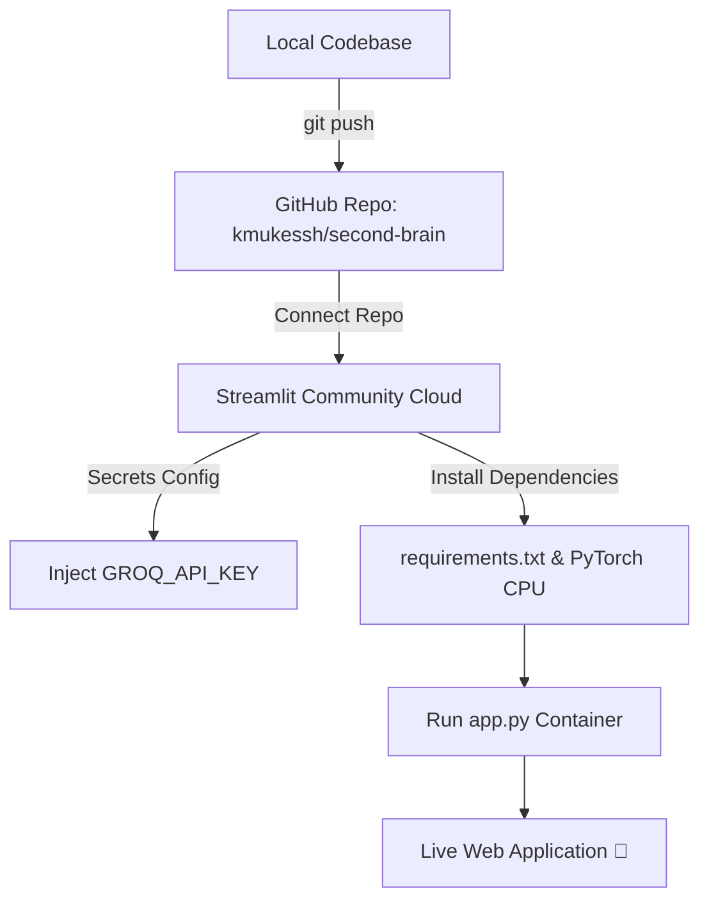
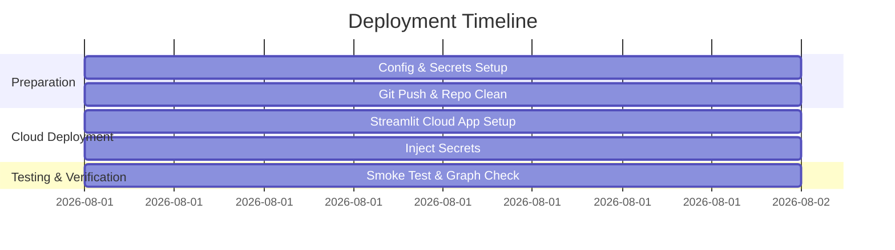

# 🚀 Streamlit Cloud Deployment Plan for SecondSelf

> **Project:** SecondSelf — Personal AI Second Brain  
> **Target Platform:** Streamlit Community Cloud (share.streamlit.io)  
> **Main Entrypoint:** [`app.py`](file:///C:/Users/kmuke/OneDrive/Documents/second%20brain/app.py)  
> **Repository:** `kmukessh/second-brain`  

---

## 📋 Overview

This deployment plan provides a step-by-step guide to deploying **SecondSelf** to **Streamlit Community Cloud**. It covers environment setup, secrets management for the Groq API key, handling sentence-transformers/PyTorch dependencies, managing local filesystem persistence, and post-deployment verification.



---

## ⚙️ 1. Pre-Deployment Configuration

### A. Environment Secrets Management
Streamlit Cloud manages sensitive credentials using `.streamlit/secrets.toml` or the cloud secrets manager UI.

1. Ensure `.env` is listed in `.gitignore` (already configured).
2. Prepare your secret key values in TOML format:

```toml
# Streamlit Secrets Format (TOML)
GROQ_API_KEY = "gsk_your_actual_groq_api_key_here"
GROQ_MODEL = "llama-3.1-8b-instant"
EMBEDDING_MODEL = "all-MiniLM-L6-v2"
SIMILARITY_THRESHOLD = "0.75"
RAG_TOP_K = "5"
```

3. Update [`config.py`](file:///C:/Users/kmuke/OneDrive/Documents/second%20brain/config.py) to read from `st.secrets` with fallback to `os.getenv`:

```python
import os
from pathlib import Path
from dotenv import load_dotenv

load_dotenv()

# Streamlit Secrets compatibility layer
def get_secret(key: str, default: str = "") -> str:
    try:
        import streamlit as st
        if key in st.secrets:
            return str(st.secrets[key])
    except Exception:
        pass
    return os.getenv(key, default)

GROQ_API_KEY = get_secret("GROQ_API_KEY", "")
GROQ_MODEL = get_secret("GROQ_MODEL", "llama-3.1-8b-instant")
EMBEDDING_MODEL = get_secret("EMBEDDING_MODEL", "all-MiniLM-L6-v2")
```

---

## 📦 2. Dependency Optimization for Streamlit Cloud

Streamlit Community Cloud free tier has a **1.0 GB RAM limit** and **1 GB resource limit per build**. Heavy PyTorch GPU wheels can cause build timeouts or memory exceeding limits.

### Recommended `requirements.txt`
To optimize build speed and RAM consumption, enforce CPU-only PyTorch by updating [`requirements.txt`](file:///C:/Users/kmuke/OneDrive/Documents/second%20brain/requirements.txt):

```text
streamlit>=1.30.0
groq>=0.4.0
sentence-transformers>=2.2.2
pypdf>=3.17.0
python-frontmatter>=1.0.0
requests>=2.31.0
beautifulsoup4>=4.12.0
numpy>=1.24.0
python-dotenv>=1.0.0
typer>=0.9.0
```

> [!TIP]
> **SentenceTransformer Caching**: Ensure `SentenceTransformer` models are loaded using `@st.cache_resource` in [`app.py`](file:///C:/Users/kmuke/OneDrive/Documents/second%20brain/app.py) or `link.py`/`ask.py` so the neural weights remain cached across app re-runs without exceeding RAM limits.

---

## 💾 3. Data Persistence Considerations

Streamlit Community Cloud containers use an **ephemeral filesystem**. Any new captured notes or graph rebuilds executed inside the deployed app container will reset when the container sleeps or restarts.

| Storage Strategy | Pros | Cons | Recommendation |
| :--- | :--- | :--- | :--- |
| **Ephemeral Filesystem (Default)** | Zero extra setup | Notes reset on app reboot | Ideal for read-only showcase / demo |
| **GitHub Automated Sync** | Persists directly to git repo | Requires GitHub Personal Access Token | Best for personal second-brain notes |
| **External Cloud Storage (S3 / Supabase)** | Robust, scalable persistence | Requires setting up cloud bucket | Recommended for multi-user production |

---

## 🛠️ 4. Step-by-Step Deployment Instructions

### Step 1: Push Local Code to GitHub
Ensure all latest code, scaffold directories (`wiki/`, `data/`, `raw/`), and initial notes are committed and pushed:

```bash
git add .
git commit -m "feat: prepare project for Streamlit Cloud deployment"
git push origin main
```

### Step 2: Create App on Streamlit Cloud
1. Navigate to **[share.streamlit.io](https://share.streamlit.io/)** and sign in with your GitHub account (`kmukessh`).
2. Click **"Create app"** (or **"New app"**).
3. Select **"I already have an app"**.
4. Fill in the repository details:
   - **Repository:** `kmukessh/second-brain`
   - **Branch:** `main`
   - **Main file path:** `app.py`
   - **App URL (optional):** `second-self-brain.streamlit.app`

### Step 3: Configure Cloud Secrets
1. Before clicking Deploy, click **"Advanced settings..."**.
2. Click on the **"Secrets"** section.
3. Paste the contents of your secret key-values:

```toml
GROQ_API_KEY = "your_actual_groq_api_key"
GROQ_MODEL = "llama-3.1-8b-instant"
EMBEDDING_MODEL = "all-MiniLM-L6-v2"
```

4. Click **Save**.
5. Click **Deploy!**

---

## 🧪 5. Post-Deployment Verification & Smoke Test

Once the build logs finish compiling and the app launches, perform the following verification steps:

- [ ] **UI Rendering:** Verify dark glassmorphism styling, header gradient, and layout load cleanly without missing CSS artifacts.
- [ ] **Knowledge Graph Visualization:** Confirm the `vis-network` interactive graph loads in the left panel from [`data/graph.json`](file:///C:/Users/kmuke/OneDrive/Documents/second%20brain/data/graph.json).
- [ ] **Sidebar Statistics:** Check that total notes, links, and PARA breakdown metrics reflect accurately.
- [ ] **RAG Q&A (The Oracle):** Submit a test query in the search bar (e.g., *"What notes do I have about Python?"*). Confirm citations and context snippets generate correctly from Groq LLM.
- [ ] **Capture Inbox Test:** Try submitting a quick note via the sidebar capture tab and click **"Process & Rebuild Graph"**.

---

## 🔍 6. Troubleshooting & Common Issues

| Issue | Cause | Fix / Mitigation |
| :--- | :--- | :--- |
| `ModuleNotFoundError: No module named 'groq'` | Missing dependency in `requirements.txt` | Add `groq` to `requirements.txt` and push to GitHub. |
| `KeyError: 'GROQ_API_KEY'` | Secret missing in Streamlit Cloud Dashboard | Go to App Settings -> Secrets in Streamlit Dashboard and add `GROQ_API_KEY`. |
| `Streamlit API error: Memory Limit Exceeded` | `SentenceTransformer` loaded multiple times into RAM | Wrap model initialization inside `@st.cache_resource`. |
| Vis-network HTML not displaying | Relative path or components iframe security issue | Verify `components.html()` receives valid HTML string from graph builder. |

---

## 🏷️ Summary Matrix



---
*Created for **SecondSelf** by Mukesh ([@kmukessh](https://github.com/kmukessh))*
